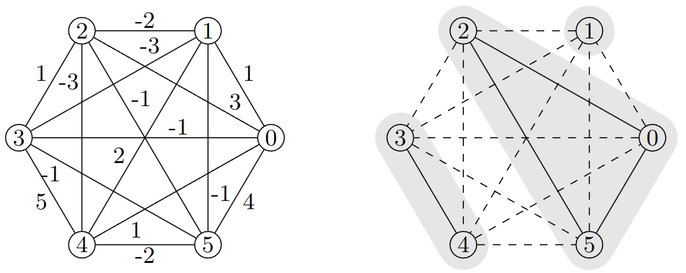

# A cutting plane algorithm for the clique partitioning problem

This repository contains the source code to the paper 


> Irmai and Andres: A State-of-the-Art Cutting Plane Algorithm for Clique Partitioning. GCPR (2024)



## Requirements
[Gurobi](https://www.gurobi.com/documentation/current/refman/cpp_api_overview.html)

## Build

```bash
mkdir build
cd build
cmake ..
cmake --build ./
```

## Usage
```bash
./main path/to/instance.txt
```

## Example

Executing 
```bash
./main ../data/example-from-paper.txt
```
produces the following output

```
 Iter EXPND OPNND DEPTH      TIME   LP-TIME    OBJBST    OBJBND    NODBND   %I #Constr             Triangle             OddWheel 
    0     0     0     0 0.0019531 0.0019531        11        11        11  100      14    0       0       0    0       0       0 
    0     1     0     0 0.0019531 0.0019531        11        11        11  100      14    0       0       0    0       0       0 
upper bound = 11
best integer feasible objective = 11
```
The Output to the console includes the following columns:
- `Iter`: Number of times the separation callback was called.
- `EXPND`: Number of nodes of the branch tree whose LP has been already solved.
- `OPNND`: Number of open nodes of the branch tree whose LP has not been solved.
- `DEPTH`: Depth of the node of the branch tree whose LP is solved at the moment.
- `TIME`: Total elapsed time.
- `LP-TIME`: Total time consumed by the LP solver.
- `OBJBST`: Objective value of the best integer feasible solution found so far.
- `OBJBND`: Upper bound computed by the cutting plane algorithm
- `NODBND`: LP bound of the nodes whose LP is solved currently (always smaller than `OBJBND`).
- `%I`: Percentage of integer variables in the current LP solution.
- `#Constr`: Total number of inequalities added to all LPs during the branch and cut algorithm.
- For each separation algorithm that is added to the callback there are three numbers:
    - Total number of times the algorithm has been called.
    - Total number of violated inequalities that were computed by the algorithm.
    - Total time consumed by the algorithm.

## Python interface
Building the project also creates a python module that can be imported and used from within python.
The usage is demonstrated within the `python_example.py` file.
The `clique_partitioning.bnc` method takes the following arguments
- `n`: number of nodes.
- `costs`: list or of edges costs in a continuous sequence `[c_{0,1},c_{0,2},...,c_{0,n-1},c_{1,2},...,c_{1,n-1},...,c_{n-2,n-1}]`.
- `activate_branching`: Flag that indicates whether branching is activated. If False, only the LP relaxation of the root node is solved.
- `max_iter_non_basic`: Constraints that have non been basic for more than `max_iter_non_basic` consecutive iterations are removed from the LP (and may be added again at a later iteration).
- `max_tail_length` and `max_tail_threshold`: If objective value of the LP is greater `max_tail_threshold` times the previous objective value for more than `max_tail_length` iterations in a row the cutting plane algorithm terminates because 'tailing off' is triggered.
- `separators`: List of triples (`separator-name`, `stage`, `max_num`) where `separator-name` is the name of the separation algorithm, `stage` is the stage to which the algorithm should be added, and `max_num` is the maximum number of inequalities that are added per iteration (0 means no limit). Available separators are listed in the `add_separator` method of the `SeparatorCallback` class that is implemented in `include/callback.hxx`.
- `add_some_triangles`: Flag that indicates whether some triangle inequalities are added before the first call to the LP solver.
- `verbosity`: The higher the verbosity, the more information is printed to the console during the execution of the algorithm.